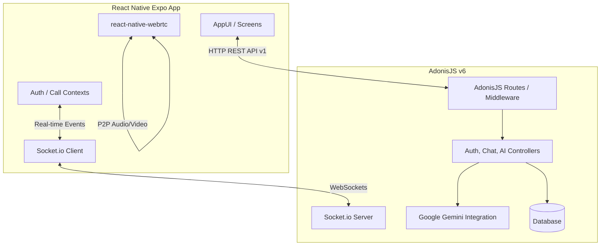

# HƯỚNG DẪN ĐÀO TẠO & TỔNG QUAN HỆ THỐNG CHAT APP (AI TRAINING GUIDE)

Tài liệu này được biên soạn để cung cấp cái nhìn toàn diện, cấu trúc chi tiết, luồng xử lý và các nguyên tắc thiết kế của hệ thống **ChatApp** (bao gồm cả ứng dụng Di động và Backend). Bất kỳ mô hình AI nào khi đọc tài liệu này đều có thể hiểu rõ kiến trúc hệ thống để phát triển, sửa lỗi và tối ưu hóa mã nguồn một cách nhanh chóng và chính xác nhất.

---

## 1. TỔNG QUAN KIẾN TRÚC HỆ THỐNG (SYSTEM OVERVIEW)

Hệ thống ChatApp được xây dựng theo mô hình **Client-Server** thời gian thực (Real-time), bao gồm hai phần chính:

*   **Frontend (ChatAppMobile)**: Ứng dụng di động xây dựng bằng **React Native (Expo SDK 54)**, sử dụng **TypeScript**, quản lý giao diện qua **NativeWind (TailwindCSS)** và tích hợp gọi video/audio qua **WebRTC**.
*   **Backend (chat-app-backend)**: Máy chủ API RESTful và WebSocket xây dựng bằng **AdonisJS v6** (Node.js framework), sử dụng **TypeScript**, lưu trữ cơ sở dữ liệu và tích hợp chatbot AI thông qua **Google Gemini API**.



---

## 2. CHI TIẾT FRONTEND: CHAT APP MOBILE

### 2.1 Cấu trúc thư mục chính
```text
ChatAppMobile/
├── assets/                 # Tài nguyên hình ảnh, biểu tượng
├── src/
│   ├── components/         # Các Component tái sử dụng (PollBubble, CallOverlay, v.v.)
│   ├── contexts/           # Quản lý State toàn cục (AuthContext, CallContext)
│   ├── data/               # Dữ liệu tĩnh, cấu hình
│   ├── hooks/              # Custom React Hooks (useTabBarVisibility, v.v.)
│   ├── navigation/         # Quản lý định tuyến (MainNavigator, TabNavigator)
│   ├── screens/            # Các màn hình chính (AiScreen, ChatScreen, HomeScreen, v.v.)
│   ├── services/           # Kết nối API & Socket (api.ts, socketService.ts, chatMappers.ts)
│   └── utils/              # Các hàm bổ trợ (avatarUtils, v.v.)
├── App.js                  # Entry point chính của ứng dụng
├── app.json                # Cấu hình dự án Expo (KeyboardLayout, Plugins, v.v.)
└── tailwind.config.js      # Cấu hình NativeWind (TailwindCSS)
```

### 2.2 Các Màn hình chính (`src/screens/`)
*   `HomeScreen.tsx`: Màn hình chính chứa danh sách các cuộc trò chuyện (Direct & Group). Hiển thị tin nhắn cuối cùng, trạng thái online/offline, số tin nhắn chưa đọc.
*   `ChatScreen.tsx` & `ChatScreenReal.tsx`: Màn hình chat trực tiếp 1-1 hoặc Chat Nhóm. Hỗ trợ gửi tin nhắn văn bản, hình ảnh, video, tài liệu, tạo bình chọn (Poll), gọi điện thoại/video và bày tỏ cảm xúc tin nhắn (Reactions).
*   `AiScreen.tsx`: Giao diện trò chuyện trực tiếp với **AI Assistant (Google Gemini)**. Hỗ trợ tạo đoạn chat mới, xem lịch sử các cuộc hội thoại AI trước đó và xóa lịch sử tin nhắn.
*   `ContactsScreen.tsx`: Danh sách bạn bè, lời mời kết bạn (gửi/nhận) và công cụ tìm kiếm người dùng bằng Email/Tên.
*   `QrScanScreen.tsx`: Quét mã QR để đăng nhập nhanh trên Web/Máy tính hoặc kết bạn.
*   `LoginScreen.tsx` / `RegisterScreen.tsx` / `VerifyEmailScreen.tsx`: Luồng xác thực tài khoản qua JWT và mã OTP Email.

### 2.3 Quản lý Trạng thái & Socket (`src/contexts/` & `src/services/`)
*   `AuthContext.tsx`: Quản lý thông tin đăng nhập, token JWT và lưu thông tin phiên làm việc thông qua `AsyncStorage`.
*   `CallContext.tsx`: Cung cấp dịch vụ cuộc gọi WebRTC. Kết hợp với `CallOverlay.tsx` để xử lý các cuộc gọi Audio/Video thời gian thực 1-1 hoặc Nhóm.
*   `socketService.ts`: Quản lý kết nối **Socket.io Client** để lắng nghe và phát tín hiệu real-time (tin nhắn mới, cập nhật bình chọn, trạng thái online/offline của bạn bè, báo cuộc họp nhóm bắt đầu).

### 2.4 Nguyên tắc Layout và Tránh Bàn phím (Keyboard Avoiding)
Đối với các màn hình Chat (`ChatScreen`, `AiScreen`), cấu trúc chuẩn để tránh bị bàn phím che mất thanh nhập liệu (`TextInput`) được thiết lập như sau:
*   Màn hình được bọc ngoài cùng bằng `SafeAreaView` từ `react-native-safe-area-context` và chỉ định `edges={["top", "left", "right"]}` để tránh xung đột padding cạnh đáy.
*   Header được đặt bên ngoài `KeyboardAvoidingView`.
*   Phần thân cuộc trò chuyện và ô nhập liệu được đặt hoàn toàn bên trong `KeyboardAvoidingView` với cấu hình:
    ```tsx
    <KeyboardAvoidingView
      behavior={Platform.OS === "ios" ? "padding" : "height"}
      keyboardVerticalOffset={Platform.OS === "ios" ? 0 : 20}
      style={{ flex: 1 }}
    >
      {/* Danh sách tin nhắn co giãn tự động */}
      <View style={{ flex: 1, backgroundColor: "#F9FAFB" }}>
        <FlatList ... />
      </View>
      
      {/* Ô nhập liệu cố định ở đáy */}
      <View className="border-t border-gray-200 bg-white px-4 py-3" style={{ paddingBottom: Math.max(insets.bottom, 12) }}>
        ...
      </View>
    </KeyboardAvoidingView>
    ```

---

## 3. CHI TIẾT BACKEND: ADONISJS V6

Backend được viết dựa trên framework **AdonisJS v6** hiện đại sử dụng TypeScript, áp dụng kiến trúc MVC và tích hợp middleware chặt chẽ.

### 3.1 Cấu trúc thư mục chính
```text
chat-app-backend/
├── app/
│   ├── controllers/        # Bộ điều khiển API (Auth, Conversations, Messages, AI, Polls, v.v.)
│   ├── middleware/         # Middleware lọc request (Auth, Admin, Presense, EmailVerified)
│   ├── models/             # Định nghĩa Schema Database (User, Conversation, Message, Poll, v.v.)
│   └── services/           # Các dịch vụ xử lý logic (ChatbotService, v.v.)
├── bin/
│   └── server.ts           # Điểm khởi chạy Server REST & WebSocket
├── config/                 # Tập hợp file cấu hình hệ thống (Swagger, Database, v.v.)
├── database/               # Quản lý Migrations & Seeders
├── start/
│   ├── kernel.ts           # Đăng ký Middleware
│   ├── env.ts              # Kiểm tra biến môi trường
│   └── routes.ts           # Quản lý tất cả các API Endpoint (REST API v1)
└── adonisrc.ts             # File cấu hình trung tâm AdonisJS
```

### 3.2 Hệ thống API Endpoints quan trọng (`start/routes.ts`)
Tất cả các route đều được tiền tố là `/api/v1` và chia thành các nhóm phân quyền:

#### Xác thực & Thành viên (Auth & Users)
*   `POST /auth/login` & `POST /auth/register`: Đăng nhập/Đăng ký tài khoản.
*   `POST /auth/verify-email`: Xác thực tài khoản qua mã OTP được gửi qua Email.
*   `GET /user/me` & `PUT /user/profile`: Xem và cập nhật thông tin cá nhân.
*   `POST /user/heartbeat`: Phát tín hiệu duy trì trạng thái hoạt động trực tuyến (Presence).
*   `POST /qr-login/scan` & `POST /qr-login/confirm`: Xác nhận đăng nhập bằng cách quét mã QR từ điện thoại di động.

#### Bạn bè & Khối chặn (Friends & Blocks)
*   `GET /friends`: Xem danh sách bạn bè hiện tại.
*   `POST /friends/requests`: Gửi lời mời kết bạn.
*   `POST /friends/requests/:id/accept` / `reject`: Đồng ý hoặc từ chối lời mời kết bạn.
*   `POST /blocks` & `DELETE /blocks/:userId`: Chặn hoặc hủy chặn người dùng.

#### Cuộc hội thoại (Conversations)
*   `GET /conversations`: Lấy danh sách các cuộc trò chuyện đã phân trang.
*   `POST /conversations/direct`: Tạo cuộc trò chuyện 1-1 trực tiếp.
*   `POST /conversations/group`: Tạo cuộc trò chuyện Nhóm.
*   `POST /conversations/:id/members`: Thêm thành viên vào nhóm (chỉ dành cho Admin/Creator).
*   `POST /conversations/:id/leave`: Rời khỏi nhóm chat.
*   `POST /conversations/:id/read`: Đánh dấu đã đọc tất cả tin nhắn trong cuộc trò chuyện.

#### Tin nhắn & Đính kèm (Messages)
*   `GET /conversations/:conversationId/messages`: Lấy lịch sử tin nhắn của cuộc trò chuyện.
*   `POST /conversations/:conversationId/messages`: Gửi tin nhắn mới (hỗ trợ reply tin nhắn cũ, đính kèm).
*   `POST /messages/upload`: Tải file đính kèm lên máy chủ (Hình ảnh, Video, Tài liệu).
*   `POST /messages/:id/recall`: Thu hồi tin nhắn đối với tất cả mọi người.
*   `POST /messages/:id/delete`: Xóa tin nhắn ở phía người dùng hiện tại (Delete for me).
*   `POST /messages/:id/reactions`: Bày tỏ cảm xúc bằng Emoji trên tin nhắn.

#### Bình chọn (Polls)
*   `POST /conversations/:conversationId/polls`: Tạo một cuộc bình chọn mới trong Nhóm.
*   `POST /polls/:id/vote` & `DELETE /polls/:id/vote`: Tiến hành bình chọn hoặc hủy bình chọn.
*   `POST /polls/:id/close`: Đóng cuộc bình chọn.

#### Chatbot AI (Tích hợp Google Gemini)
*   `POST /ai/conversations`: Khởi tạo phiên làm việc trò chuyện với AI.
*   `POST /ai/conversations/new`: Buộc tạo một phiên trò chuyện AI mới hoàn toàn.
*   `POST /ai/chat`: Nhận câu hỏi từ người dùng di động, gọi **Google Gemini API** thông qua `ChatbotService` để lấy câu trả lời và lưu trữ cả tin nhắn người dùng lẫn phản hồi AI vào cơ sở dữ liệu.

---

## 4. LUỒNG THỜI GIAN THỰC (REAL-TIME DATA FLOWS)

Mọi thay đổi trạng thái trong hệ thống đều truyền tín hiệu ngay lập tức thông qua **Socket.io**:

1.  **Gửi Tin nhắn**:
    *   Client gửi HTTP `POST /conversations/:id/messages`.
    *   Server lưu tin nhắn vào Database, sau đó phát sự kiện socket `message:new` kèm theo dữ liệu tin nhắn đã chuẩn hóa tới tất cả thành viên trong phòng chat.
    *   Các máy trạm Client nhận được sự kiện `message:new` và cập nhật tức thì danh sách tin nhắn hiển thị lên màn hình.

2.  **Cập nhật Poll (Bình chọn)**:
    *   Người dùng vote thông qua `POST /polls/:id/vote`.
    *   Server xử lý cập nhật số lượng bầu chọn và phát tín hiệu `poll:updated` qua socket.
    *   Các Client lắng nghe `poll:updated` và tự động vẽ lại thanh tỷ lệ phần trăm bình chọn mà không cần tải lại trang.

3.  **Cuộc họp & Cuộc gọi điện**:
    *   Khi cuộc họp bắt đầu, tin nhắn đặc biệt có chứa thẻ `[GROUP_CALL:STARTED]` được gửi vào phòng chat.
    *   Socket.io phát tín hiệu cuộc gọi đến máy các thành viên.
    *   Màn hình ứng dụng của các thành viên khác sẽ hiển thị Banner báo cuộc họp đang diễn ra và cho phép bấm nút "Tham gia" (Join) trực tiếp.

---

## 5. HƯỚNG DẪN DÀN CHO AI KHI THỰC THI NHIỆM VỤ (AI CODING PRINCIPLES)

Bất kỳ AI nào khi chỉnh sửa hoặc phát triển mã nguồn cho hệ thống này cần tuân thủ các quy tắc sau:

1.  **Duy trì tính đồng bộ về Kiểu dữ liệu (TypeScript Types)**:
    *   Cả Frontend và Backend đều sử dụng TypeScript nghiêm ngặt. Phải khai báo interface/type đầy đủ, không lạm dụng kiểu `any`.
    *   Sử dụng các mapper mapper ở `src/services/chatMappers.ts` trên Frontend để chuyển đổi dữ liệu thô từ API backend sang cấu trúc chuẩn hiển thị trên UI.

2.  **Chỉnh sửa giao diện cẩn thận**:
    *   Luôn dùng các class Tailwind hoặc NativeWind phù hợp trên Frontend để đồng bộ thiết kế thẩm mỹ.
    *   Với các thuộc tính quan trọng ảnh hưởng đến Layout co giãn của màn hình (như chiều cao, căn lề tránh bàn phím), hãy viết thuộc tính `style={{ ... }}` trực tiếp bằng React Native StyleSheet/Inline style để đảm bảo khả năng hiển thị ổn định trên mọi hệ điều hành.

3.  **Tối ưu hóa Hiệu năng & Rò rỉ bộ nhớ (Memory Leaks)**:
    *   Sử dụng `useCallback`, `useMemo` khi chuyển các hàm/biến qua props cho component con.
    *   Đảm bảo luôn dọn dẹp các Socket listener (`socketService.off('...')`) hoặc các bộ đếm thời gian (`clearInterval`, `clearTimeout`) trong hàm cleanup của `useEffect`.

4.  **Tương tác API**:
    *   Tất cả các API call mới cần được khai báo tập trung trong `src/services/api.ts` thay vì viết `axios` trực tiếp trong màn hình.
    *   Tự động bọc các lời gọi mạng trong khối lệnh `try...catch` và xử lý thông tin lỗi trực quan tới người dùng bằng `Alert.alert`.

---
*Tài liệu này được tạo ra để lưu giữ tri thức hệ thống một cách trọn vẹn và hỗ trợ đắc lực cho các AI cộng tác phát triển dự án.*
